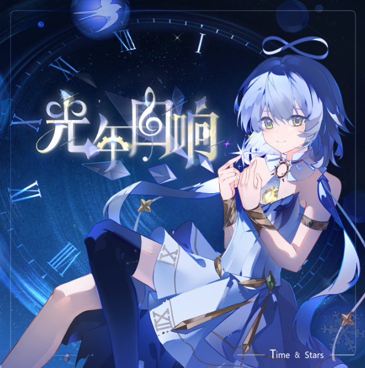

# 光年回响

**发行日期:** 2026-03-20

**出品:** 薛钦

**发布:** [Bilibili](https://www.bilibili.com/video/BV1ejAjz4Ena)

**演唱:** 洛天依

**作词:** Kevinz、雒清辞明、CrClr、果汁凉菜、薛钦、空气凝

**作曲:** 1-Zero、空气凝

**编曲:** 1-Zero

**调校:** 鬼面P、磷元素P、潜水荷叶、阿耗、Eden

**曲绘:** 忒猫头、薛钦、潼玖

**混音:** Wovop、CrClr、欧Ωhm、棕色环、阿耗、Eden / 咖喱

## 曲目列表

- [Intro-Aware](https://cdn.jsdelivr.net/gh/wuyilingwei/LRC@main/res/%E5%85%89%E5%B9%B4%E5%9B%9E%E5%93%8D/Intro-Aware.lrc)
- [Outro-FIND](https://cdn.jsdelivr.net/gh/wuyilingwei/LRC@main/res/%E5%85%89%E5%B9%B4%E5%9B%9E%E5%93%8D/Outro-FIND.lrc)
- [Summer Diary](https://cdn.jsdelivr.net/gh/wuyilingwei/LRC@main/res/%E5%85%89%E5%B9%B4%E5%9B%9E%E5%93%8D/Summer%20Diary.lrc)
- [原恒星](https://cdn.jsdelivr.net/gh/wuyilingwei/LRC@main/res/%E5%85%89%E5%B9%B4%E5%9B%9E%E5%93%8D/%E5%8E%9F%E6%81%92%E6%98%9F.lrc)
- [向春归](https://cdn.jsdelivr.net/gh/wuyilingwei/LRC@main/res/%E5%85%89%E5%B9%B4%E5%9B%9E%E5%93%8D/%E5%90%91%E6%98%A5%E5%BD%92.lrc)
- [向融雪处](https://cdn.jsdelivr.net/gh/wuyilingwei/LRC@main/res/%E5%85%89%E5%B9%B4%E5%9B%9E%E5%93%8D/%E5%90%91%E8%9E%8D%E9%9B%AA%E5%A4%84.lrc)
- [夏日寻踪](https://cdn.jsdelivr.net/gh/wuyilingwei/LRC@main/res/%E5%85%89%E5%B9%B4%E5%9B%9E%E5%93%8D/%E5%A4%8F%E6%97%A5%E5%AF%BB%E8%B8%AA.lrc)
- [当你如光漂泊](https://cdn.jsdelivr.net/gh/wuyilingwei/LRC@main/res/%E5%85%89%E5%B9%B4%E5%9B%9E%E5%93%8D/%E5%BD%93%E4%BD%A0%E5%A6%82%E5%85%89%E6%BC%82%E6%B3%8A.lrc)
- [纪念](https://cdn.jsdelivr.net/gh/wuyilingwei/LRC@main/res/%E5%85%89%E5%B9%B4%E5%9B%9E%E5%93%8D/%E7%BA%AA%E5%BF%B5.lrc)
- [落叶坠海时](https://cdn.jsdelivr.net/gh/wuyilingwei/LRC@main/res/%E5%85%89%E5%B9%B4%E5%9B%9E%E5%93%8D/%E8%90%BD%E5%8F%B6%E5%9D%A0%E6%B5%B7%E6%97%B6.lrc)

## 下载

下载本专辑所有歌词文件：[ZIP 打包下载](https://cdn.jsdelivr.net/gh/wuyilingwei/LRC@main/pack/%E5%85%89%E5%B9%B4%E5%9B%9E%E5%93%8D.zip)
