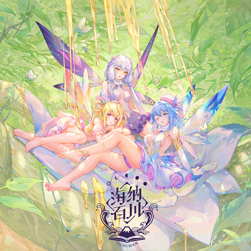

# 海纳百川Storybook

**发行日期:** 2020-11-06

**出品:** 平行四界Quadimension

**歌词制作:** 虎啸ROAR

**发布:** [Bilibili](https://www.bilibili.com/video/BV1ND4y1R7fB/)

**购买:** [淘宝 平行四界Quadimension](http://t.cn/A6GtIEhX) ￥75/￥110/￥150/￥200

**电子:** 随专辑附赠

**演唱:** 星尘、海伊、诗岸

**作词:** Ddickky、大♂古、芍杳、大九_LN、绿无、杏花包子、Zeno

**作曲:** Kide、papaw泡泡、Evalia、星辉P、公兔、磁带君、MeLo、PoKeR、Zeno

**编曲:** Kide、papaw泡泡、Evalia、星辉P、公兔、磁带君、MeLo、PoKeR、Zeno

**调校:** 瑞安Ryan、折v、奶油蘑菇、坐标P

**曲绘:** 大汉Jax、November、Hanasa、原子Dan、匙、影依望远镜、Leiq雷、-REDUM-、青梅丨plumw

**混音:** 公兔、哈密瓜

## 曲目列表

- [01.蜜药](https://cdn.jsdelivr.net/gh/wuyilingwei/LRC@main/res/%E6%B5%B7%E7%BA%B3%E7%99%BE%E5%B7%9DStorybook/01.%E8%9C%9C%E8%8D%AF.lrc)
- [02.cola palapa](https://cdn.jsdelivr.net/gh/wuyilingwei/LRC@main/res/%E6%B5%B7%E7%BA%B3%E7%99%BE%E5%B7%9DStorybook/02.cola%20palapa.lrc)
- [03.strand siren - 搁浅的塞壬](https://cdn.jsdelivr.net/gh/wuyilingwei/LRC@main/res/%E6%B5%B7%E7%BA%B3%E7%99%BE%E5%B7%9DStorybook/03.strand%20siren%20-%20%E6%90%81%E6%B5%85%E7%9A%84%E5%A1%9E%E5%A3%AC.lrc)
- [04.墨恋仙](https://cdn.jsdelivr.net/gh/wuyilingwei/LRC@main/res/%E6%B5%B7%E7%BA%B3%E7%99%BE%E5%B7%9DStorybook/04.%E5%A2%A8%E6%81%8B%E4%BB%99.lrc)
- [05.一剪人间客](https://cdn.jsdelivr.net/gh/wuyilingwei/LRC@main/res/%E6%B5%B7%E7%BA%B3%E7%99%BE%E5%B7%9DStorybook/05.%E4%B8%80%E5%89%AA%E4%BA%BA%E9%97%B4%E5%AE%A2.lrc)
- [06.海底](https://cdn.jsdelivr.net/gh/wuyilingwei/LRC@main/res/%E6%B5%B7%E7%BA%B3%E7%99%BE%E5%B7%9DStorybook/06.%E6%B5%B7%E5%BA%95.lrc)
- [07.百里芭蕉百里花](https://cdn.jsdelivr.net/gh/wuyilingwei/LRC@main/res/%E6%B5%B7%E7%BA%B3%E7%99%BE%E5%B7%9DStorybook/07.%E7%99%BE%E9%87%8C%E8%8A%AD%E8%95%89%E7%99%BE%E9%87%8C%E8%8A%B1.lrc)
- [08.零和Zero-Sum](https://cdn.jsdelivr.net/gh/wuyilingwei/LRC@main/res/%E6%B5%B7%E7%BA%B3%E7%99%BE%E5%B7%9DStorybook/08.%E9%9B%B6%E5%92%8CZero-Sum.lrc)
- [09.最后的守护](https://cdn.jsdelivr.net/gh/wuyilingwei/LRC@main/res/%E6%B5%B7%E7%BA%B3%E7%99%BE%E5%B7%9DStorybook/09.%E6%9C%80%E5%90%8E%E7%9A%84%E5%AE%88%E6%8A%A4.lrc)

## 下载

下载本专辑所有歌词文件：[ZIP 打包下载](https://cdn.jsdelivr.net/gh/wuyilingwei/LRC@main/pack/%E6%B5%B7%E7%BA%B3%E7%99%BE%E5%B7%9DStorybook.zip)
