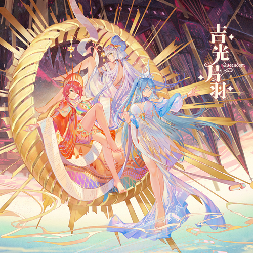

# 吉光片羽 Queendom

**发行日期:** 2020-06-12

**出品:** 平行四界Quadimension

**歌词制作:** 初天星_official

**发布:** [Bilibili](https://www.bilibili.com/video/BV1BA411v7uJ/)

                    ::: detail 预览
                    <iframe src="//player.bilibili.com/player.html?isOutside=true&bvid=BV1BA411v7uJ&poster=true&autoplay=true&muted=false&danmaku=true" '
                    'scrolling="no" border="0" frameborder="no" framespacing="0" '
                    'allowfullscreen="true" style="width:100%;aspect-ratio:16/9;max-width:960px;"></iframe>
                    :::
                    

**购买:** [淘宝 平行四界Quadimension](http://t.cn/A62s4zQQ) ￥75/￥120/￥140/￥190/￥220

**电子:** 随专辑附赠

**演唱:** 星尘、苍穹、赤羽

**作词:** Evalia、大九_LN、浓缩排骨、Zeno、绿无、芍杳、JUSF周存、胧、沈病娇

**作曲:** Evalia、味素、磁带君、Zeno、MeLo、papaw泡泡、JUSF周存、胧、Kide

**编曲:** Evalia、味素、磁带君、Zeno、MeLo、papaw泡泡、JUSF周存、胧、Kide

**调校:** 瑞安Ryan、木变石、Creuzer、MeLo、JUSF周存、坐标P、顾令

**曲绘:** Hanasa、原子Dan、大汉Jax、立旗、Noir、KyuriTizu、November、匙、Leiq雷

## 曲目列表

- [01.不夜国](https://cdn.jsdelivr.net/gh/wuyilingwei/LRC@main/res/%E5%90%89%E5%85%89%E7%89%87%E7%BE%BDQueendom/01.%E4%B8%8D%E5%A4%9C%E5%9B%BD.lrc)
- [02.dancing like a wind](https://cdn.jsdelivr.net/gh/wuyilingwei/LRC@main/res/%E5%90%89%E5%85%89%E7%89%87%E7%BE%BDQueendom/02.dancing%20like%20a%20wind.lrc)
- [03.希望悬空](https://cdn.jsdelivr.net/gh/wuyilingwei/LRC@main/res/%E5%90%89%E5%85%89%E7%89%87%E7%BE%BDQueendom/03.%E5%B8%8C%E6%9C%9B%E6%82%AC%E7%A9%BA.lrc)
- [04.沙舟](https://cdn.jsdelivr.net/gh/wuyilingwei/LRC@main/res/%E5%90%89%E5%85%89%E7%89%87%E7%BE%BDQueendom/04.%E6%B2%99%E8%88%9F.lrc)
- [05.优雅的罪恶之源](https://cdn.jsdelivr.net/gh/wuyilingwei/LRC@main/res/%E5%90%89%E5%85%89%E7%89%87%E7%BE%BDQueendom/05.%E4%BC%98%E9%9B%85%E7%9A%84%E7%BD%AA%E6%81%B6%E4%B9%8B%E6%BA%90.lrc)
- [06.少年诗](https://cdn.jsdelivr.net/gh/wuyilingwei/LRC@main/res/%E5%90%89%E5%85%89%E7%89%87%E7%BE%BDQueendom/06.%E5%B0%91%E5%B9%B4%E8%AF%97.lrc)
- [07.第七恒星自毁](https://cdn.jsdelivr.net/gh/wuyilingwei/LRC@main/res/%E5%90%89%E5%85%89%E7%89%87%E7%BE%BDQueendom/07.%E7%AC%AC%E4%B8%83%E6%81%92%E6%98%9F%E8%87%AA%E6%AF%81.lrc)
- [08.Mandala](https://cdn.jsdelivr.net/gh/wuyilingwei/LRC@main/res/%E5%90%89%E5%85%89%E7%89%87%E7%BE%BDQueendom/08.Mandala.lrc)
- [09.苍穹](https://cdn.jsdelivr.net/gh/wuyilingwei/LRC@main/res/%E5%90%89%E5%85%89%E7%89%87%E7%BE%BDQueendom/09.%E8%8B%8D%E7%A9%B9.lrc)

## 下载

下载本专辑所有歌词文件：[ZIP 打包下载](https://cdn.jsdelivr.net/gh/wuyilingwei/LRC@main/pack/%E5%90%89%E5%85%89%E7%89%87%E7%BE%BDQueendom.zip)
