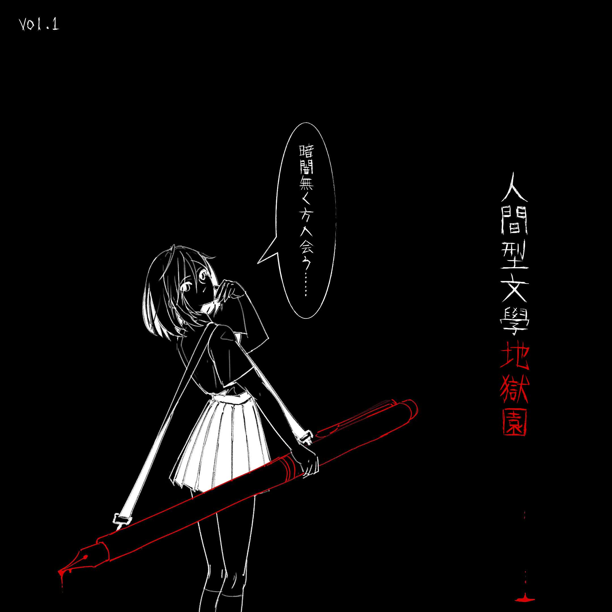

# 人間型文學地獄園

**发行日期:** 2026-02-01

**出品:** Asian Lo-Fi Inc.

**发布:** [Bilibili](https://www.bilibili.com/video/BV1rW6nBZEbe/)

**购买:** 未开售

**电子:** [dizzylab](https://www.dizzylab.net/d/HELL-01) [网易云音乐](https://music.163.com/#/album?id=360184202)

**演唱:** 星尘Infinity、GUMI、重音テト

**作词:** 雍雁P、TOPKINGCREAM、SaladCup、DIAO_P

**作曲:** 雍雁P、TOPKINGCREAM、SaladCup、逃避電工

**编曲:** 雍雁P、TOPKINGCREAM、SaladCup、DIAO P

**调校:** 雍雁P、TOPKINGCREAM、SaladCup

**曲绘:** 循汩gu

**混音:** 雍雁P、DIAO_P、本体逃逸

## 曲目列表

- [1 ЯενοιυτιοΠ](https://cdn.jsdelivr.net/gh/lsy-404/LRC@main/res/%E4%BA%BA%E9%96%93%E5%9E%8B%E6%96%87%E5%AD%B8%E5%9C%B0%E7%8D%84%E5%9C%92/1%20%D0%AF%CE%B5%CE%BD%CE%BF%CE%B9%CF%85%CF%84%CE%B9%CE%BF%CE%A0.lrc)
- [2 擬劇論 [Remastered]](https://cdn.jsdelivr.net/gh/lsy-404/LRC@main/res/%E4%BA%BA%E9%96%93%E5%9E%8B%E6%96%87%E5%AD%B8%E5%9C%B0%E7%8D%84%E5%9C%92/2%20%E6%93%AC%E5%8A%87%E8%AB%96%20%5BRemastered%5D.lrc)
- [3 ブギス・シガラボレギ・ダンス](https://cdn.jsdelivr.net/gh/lsy-404/LRC@main/res/%E4%BA%BA%E9%96%93%E5%9E%8B%E6%96%87%E5%AD%B8%E5%9C%B0%E7%8D%84%E5%9C%92/3%20%E3%83%96%E3%82%AE%E3%82%B9%E3%83%BB%E3%82%B7%E3%82%AC%E3%83%A9%E3%83%9C%E3%83%AC%E3%82%AE%E3%83%BB%E3%83%80%E3%83%B3%E3%82%B9.lrc)
- [4 エネルギー丸薬](https://cdn.jsdelivr.net/gh/lsy-404/LRC@main/res/%E4%BA%BA%E9%96%93%E5%9E%8B%E6%96%87%E5%AD%B8%E5%9C%B0%E7%8D%84%E5%9C%92/4%20%E3%82%A8%E3%83%8D%E3%83%AB%E3%82%AE%E3%83%BC%E4%B8%B8%E8%96%AC.lrc)
- [5 自殺型人間](https://cdn.jsdelivr.net/gh/lsy-404/LRC@main/res/%E4%BA%BA%E9%96%93%E5%9E%8B%E6%96%87%E5%AD%B8%E5%9C%B0%E7%8D%84%E5%9C%92/5%20%E8%87%AA%E6%AE%BA%E5%9E%8B%E4%BA%BA%E9%96%93.lrc)

## 下载

下载本专辑所有歌词文件：[ZIP 打包下载](https://cdn.jsdelivr.net/gh/lsy-404/LRC@main/pack/%E4%BA%BA%E9%96%93%E5%9E%8B%E6%96%87%E5%AD%B8%E5%9C%B0%E7%8D%84%E5%9C%92.zip)
