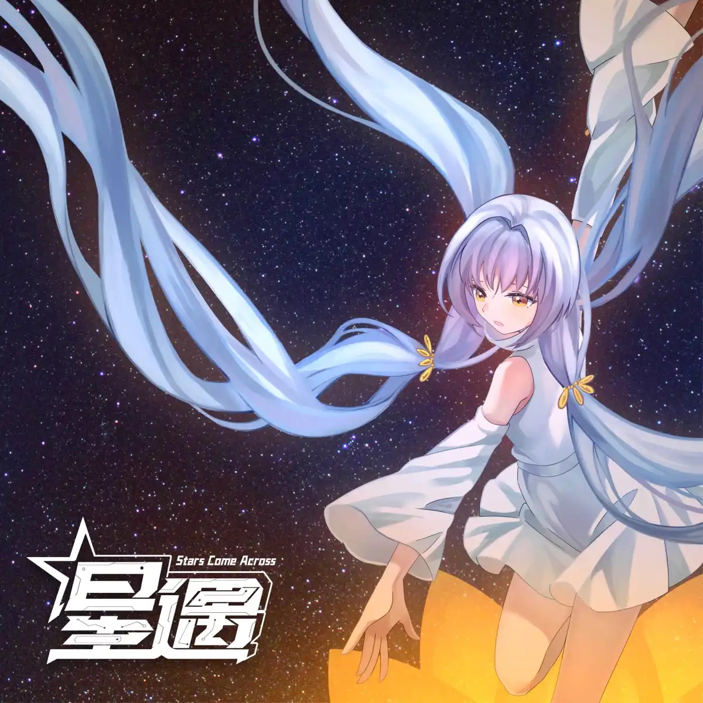

# 星遇

**发行日期:** 2024-08-12

**出品:** 青蓝、夜屠灵

**歌词制作:** 神武竹

**发布:** [Bilibili](https://www.bilibili.com/video/BV1h3YdeUEcU/)

                    ::: detail 预览
                    <iframe src="//player.bilibili.com/player.html?isOutside=true&bvid=BV1h3YdeUEcU&poster=true&autoplay=true&muted=false&danmaku=true" '
                    'scrolling="no" border="0" frameborder="no" framespacing="0" '
                    'allowfullscreen="true" style="width:100%;aspect-ratio:16/9;max-width:960px;"></iframe>
                    :::
                    

**购买:** 通贩不可用

**电子:** 随专辑附赠

**演唱:** 星尘

**作词:** 安筱然、静听、水螅、星语落枫、江北忆、亦晗、珞一

**作曲:** 夜屠灵、大懒、星语落枫、ILLUSION-哲、祈忧、涅不拉几的

**编曲:** 夜屠灵、大懒、ILLUSION-哲、祈忧、涅不拉几的

**调校:** 九雪ICE、桂月锁心、某只泽、跨海星尘、霜凝玥、茂名经济黑洞

**曲绘:** 是桔子不是橘子的桔子、GX君、浅笑、咲柰、酒井栗子、白、椿色墨魚餅、林羊、积雨云

**混音:** 唐兰P、夜屠灵、虎皮猫、ILLUSION-哲、樱庭落、涅不拉几的

## 曲目列表

- [01 我的期待](https://cdn.jsdelivr.net/gh/wuyilingwei/LRC@main/res/%E6%98%9F%E9%81%87/01%20%E6%88%91%E7%9A%84%E6%9C%9F%E5%BE%85.lrc)
- [02 鱼缸里的海鸥](https://cdn.jsdelivr.net/gh/wuyilingwei/LRC@main/res/%E6%98%9F%E9%81%87/02%20%E9%B1%BC%E7%BC%B8%E9%87%8C%E7%9A%84%E6%B5%B7%E9%B8%A5.lrc)
- [03 帕耳塞洛珀](https://cdn.jsdelivr.net/gh/wuyilingwei/LRC@main/res/%E6%98%9F%E9%81%87/03%20%E5%B8%95%E8%80%B3%E5%A1%9E%E6%B4%9B%E7%8F%80.lrc)
- [04 我要的浪漫](https://cdn.jsdelivr.net/gh/wuyilingwei/LRC@main/res/%E6%98%9F%E9%81%87/04%20%E6%88%91%E8%A6%81%E7%9A%84%E6%B5%AA%E6%BC%AB.lrc)
- [05 单行道](https://cdn.jsdelivr.net/gh/wuyilingwei/LRC@main/res/%E6%98%9F%E9%81%87/05%20%E5%8D%95%E8%A1%8C%E9%81%93.lrc)
- [06 星沙蜃景](https://cdn.jsdelivr.net/gh/wuyilingwei/LRC@main/res/%E6%98%9F%E9%81%87/06%20%E6%98%9F%E6%B2%99%E8%9C%83%E6%99%AF.lrc)
- [07 沙画](https://cdn.jsdelivr.net/gh/wuyilingwei/LRC@main/res/%E6%98%9F%E9%81%87/07%20%E6%B2%99%E7%94%BB.lrc)
- [08 山际城缘游](https://cdn.jsdelivr.net/gh/wuyilingwei/LRC@main/res/%E6%98%9F%E9%81%87/08%20%E5%B1%B1%E9%99%85%E5%9F%8E%E7%BC%98%E6%B8%B8.lrc)
- [09 写诗的人](https://cdn.jsdelivr.net/gh/wuyilingwei/LRC@main/res/%E6%98%9F%E9%81%87/09%20%E5%86%99%E8%AF%97%E7%9A%84%E4%BA%BA.lrc)
- [10 只是几块入夜前仍在打转的碎玻璃](https://cdn.jsdelivr.net/gh/wuyilingwei/LRC@main/res/%E6%98%9F%E9%81%87/10%20%E5%8F%AA%E6%98%AF%E5%87%A0%E5%9D%97%E5%85%A5%E5%A4%9C%E5%89%8D%E4%BB%8D%E5%9C%A8%E6%89%93%E8%BD%AC%E7%9A%84%E7%A2%8E%E7%8E%BB%E7%92%83.lrc)

## 下载

下载本专辑所有歌词文件：[ZIP 打包下载](https://cdn.jsdelivr.net/gh/wuyilingwei/LRC@main/pack/%E6%98%9F%E9%81%87.zip)
