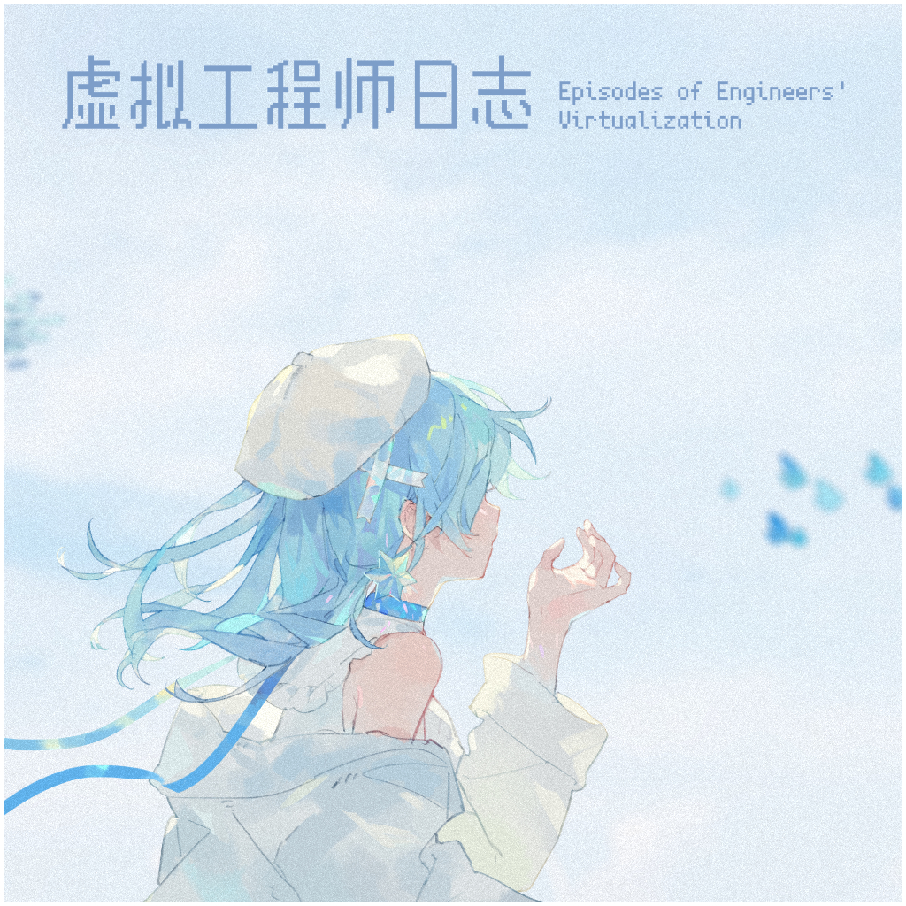

# 虚拟工程师日志 episodes-of-engineers-virtualization

**发行日期:** 2023-05-14

**出品:** Zill

**歌词制作:** SST

**发布:** [Bilibili](https://www.bilibili.com/video/BV1Lg4y1V7Et)

**购买:** 通贩不可用

**电子:** [dizzylab] (https://www.dizzylab.net/d/episodes-of-engineers-virtualization/ https://www.dizzylab.net/d/episodes-of-engineers-virtualization-side-b/) ￥30

**演唱:** 海伊、星尘、夏语遥

**作词:** Zili

**作曲:** Zili

**编曲:** Zili

**调校:** Zili

**曲绘:** 前川琳子、Nebulium__、小早川塵也、深海小镇与猫、巴拉冰、薬屋、森地林边

**混音:** Zili

## 曲目列表

- [1 测试实验 编号0001](https://cdn.jsdelivr.net/gh/lsy-404/LRC@main/res/%E8%99%9A%E6%8B%9F%E5%B7%A5%E7%A8%8B%E5%B8%88%E6%97%A5%E5%BF%97/1%20%E6%B5%8B%E8%AF%95%E5%AE%9E%E9%AA%8C%20%E7%BC%96%E5%8F%B70001.lrc)
- [2 虚拟星门夜曲](https://cdn.jsdelivr.net/gh/lsy-404/LRC@main/res/%E8%99%9A%E6%8B%9F%E5%B7%A5%E7%A8%8B%E5%B8%88%E6%97%A5%E5%BF%97/2%20%E8%99%9A%E6%8B%9F%E6%98%9F%E9%97%A8%E5%A4%9C%E6%9B%B2.lrc)
- [3 石室激光器](https://cdn.jsdelivr.net/gh/lsy-404/LRC@main/res/%E8%99%9A%E6%8B%9F%E5%B7%A5%E7%A8%8B%E5%B8%88%E6%97%A5%E5%BF%97/3%20%E7%9F%B3%E5%AE%A4%E6%BF%80%E5%85%89%E5%99%A8.lrc)
- [4 离子气泡](https://cdn.jsdelivr.net/gh/lsy-404/LRC@main/res/%E8%99%9A%E6%8B%9F%E5%B7%A5%E7%A8%8B%E5%B8%88%E6%97%A5%E5%BF%97/4%20%E7%A6%BB%E5%AD%90%E6%B0%94%E6%B3%A1.lrc)
- [5 intro：无知与童心](https://cdn.jsdelivr.net/gh/lsy-404/LRC@main/res/%E8%99%9A%E6%8B%9F%E5%B7%A5%E7%A8%8B%E5%B8%88%E6%97%A5%E5%BF%97/5%20intro%EF%BC%9A%E6%97%A0%E7%9F%A5%E4%B8%8E%E7%AB%A5%E5%BF%83.lrc)
- [6 慢步歌](https://cdn.jsdelivr.net/gh/lsy-404/LRC@main/res/%E8%99%9A%E6%8B%9F%E5%B7%A5%E7%A8%8B%E5%B8%88%E6%97%A5%E5%BF%97/6%20%E6%85%A2%E6%AD%A5%E6%AD%8C.lrc)

## 下载

下载本专辑所有歌词文件：[ZIP 打包下载](https://cdn.jsdelivr.net/gh/lsy-404/LRC@main/pack/%E8%99%9A%E6%8B%9F%E5%B7%A5%E7%A8%8B%E5%B8%88%E6%97%A5%E5%BF%97.zip)
